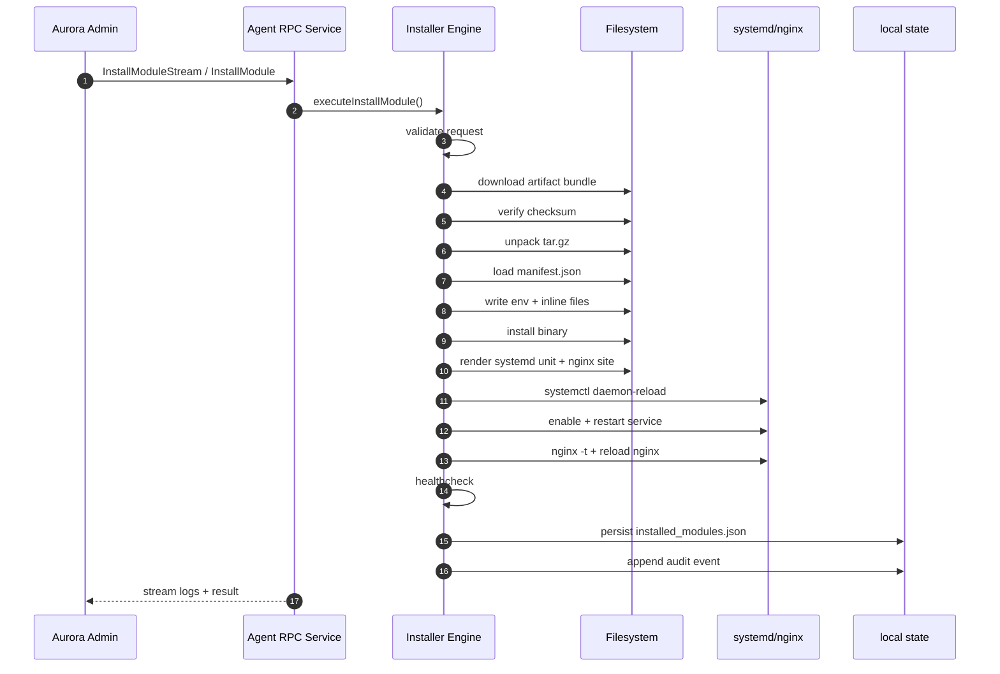
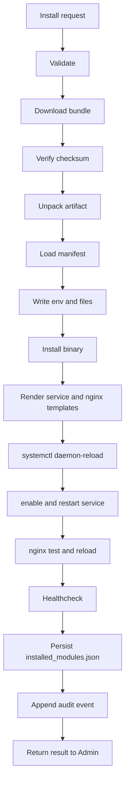

# Architecture

## High-Level

```text
+--------------------+        gRPC (mTLS)             +----------------------+
|   Aurora Agent     |  ---------------------------->  |   Aurora Admin       |
+---------+----------+                                 +----------+-----------+
          |
          | libvirt RPC
          v
+--------------------+
| libvirt / KVM host |
+--------------------+
```

## Internal Pipeline

```text
ConnManager (libvirt)
  -> NodeMetricsReader / VMMetricsReader
  -> Collector Scheduler
  -> Heartbeat Reporter (gRPC mTLS)
  -> Admin Runtime Service
```

## Core Components

### 1) Connection Manager

`internal/libvirt/conn.go`

- Quản lý `go-libvirt` client singleton
- Có `Connect`, `Client`, `Reconnect`, `Healthy`, `Close`
- Reconnect loop có jitter

### 2) Node Metrics Reader

`internal/libvirt/node_metrics.go`

- Dùng libvirt API:
  - `NodeGetInfo`
  - `NodeGetCPUStats`
  - `NodeGetMemoryStats`
- Kết hợp `/proc` counters cho disk/net/load

### 3) VM Metrics Reader

`internal/libvirt/vm_metrics.go`

- Dùng libvirt API:
  - `ConnectListAllDomains`
  - `ConnectGetAllDomainStats`
- Parse CPU/RAM/Block/Net từ typed params

### 4) Scheduler

`internal/collector/scheduler.go`

- Loop song song:
  - VM loop: mặc định mỗi `1s`
  - Node loop: mặc định mỗi `3s`
- Khi lỗi collector/send: backoff rồi retry

### 5) Admin Heartbeat Layer

`internal/adminrpc/`

- `heartbeat_client.go`: gọi `RuntimeService/ReportAgentHeartbeat`
- Payload gửi identity, version, probe/grpc endpoint
- Admin ack thành công => seed/update agent connection info vào etcd

### 6) Agent Lifecycle

`internal/agent/`

- Start: connect libvirt + khởi chạy scheduler
- Health loop: kiểm tra libvirt, tự reconnect
- Event loop: heartbeat event monitor
- Shutdown: đóng stream + disconnect libvirt

## Reliability Strategy

- Libvirt health-check định kỳ
- Reconnect khi stream/libvirt lỗi
- Context-aware cancellation cho graceful shutdown
- Structured logs để truy vết production

## Security

- Hỗ trợ mTLS bắt buộc khi agent gọi Admin
- Libvirt endpoint có thể local unix hoặc remote URI

## Installer Direction

- Kiến trúc installer phase 0 được chốt tại [AURORA_INSTALLER_PHASE0.md](/home/phucle/Desktop/project/AURORA_INSTALLER_PHASE0.md).
- Roadmap production-grade được chốt tại [AURORA_INSTALLER_PRODUCTION_GRADE.md](/home/phucle/Desktop/project/AURORA_INSTALLER_PRODUCTION_GRADE.md).
- `aurora-agent` sẽ trở thành execution plane cho module install:
  - download artifact bundle
  - verify checksum/signature
  - render env/systemd/nginx
  - install/restart/healthcheck

## Service Install Execution Flow

Hiện tại `aurora-agent` chỉ support installer runtime `linux-systemd`.





### Status Vocabulary

Agent inventory dùng các trạng thái sau để khớp với Admin reconcile:

- `installing`
- `installed`
- `failed`
- `unknown`
